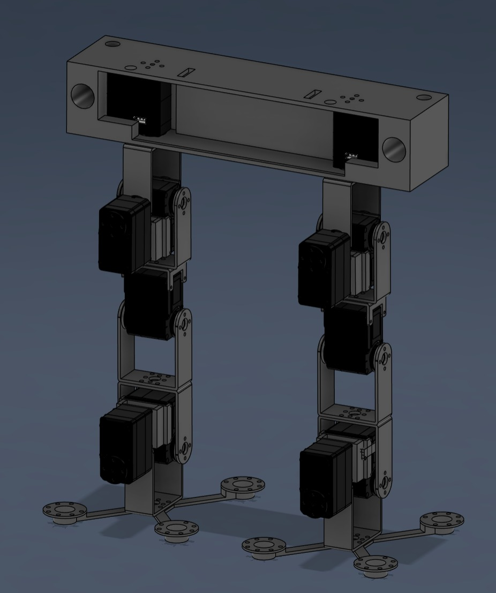
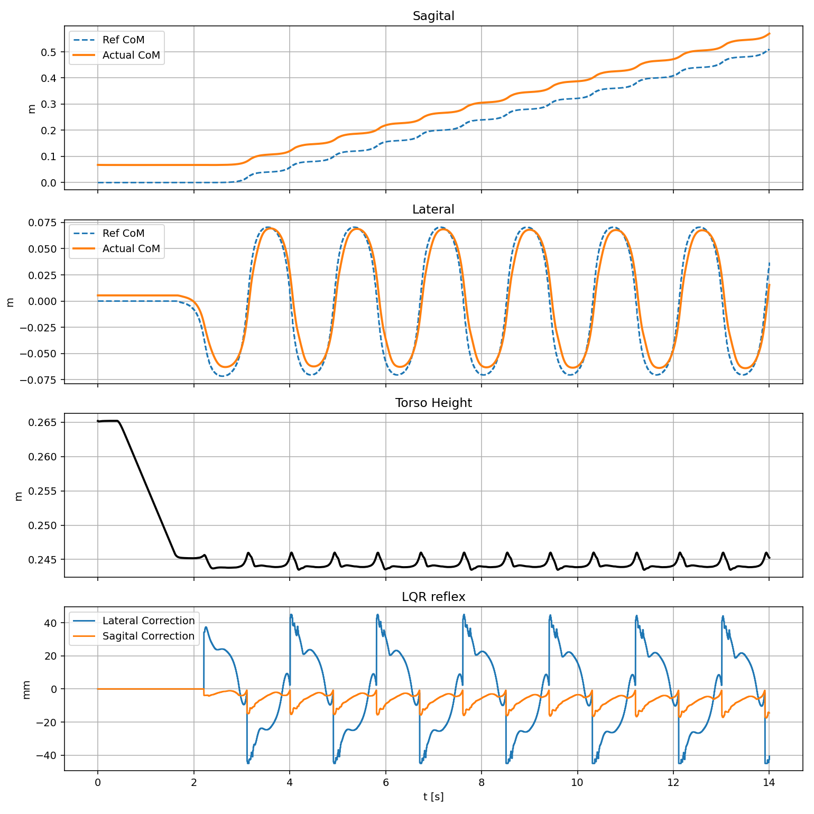
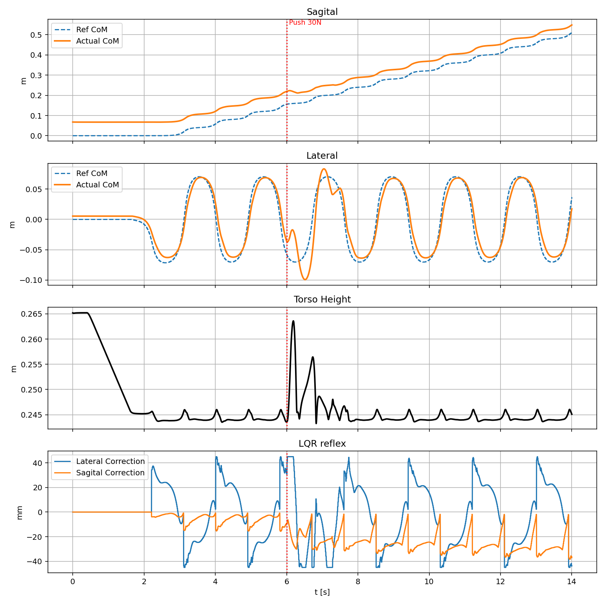
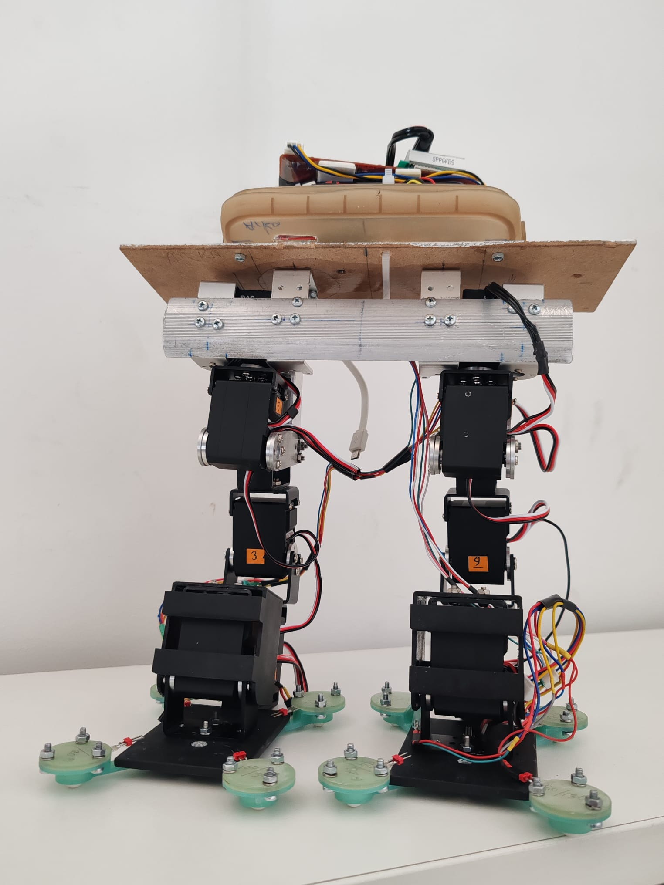

# 12-DOF Bipedal Robot Simulation with ZMP & LQR Control

This repository contains the simulation and control architecture for a custom 12-Degree-of-Freedom (DOF) bipedal robot. The project is built in Python using MuJoCo for physics simulation and focuses on robust dynamic walking and balance recovery.

The software architecture is highly modular and designed to run on low-budget, resource-constrained hardware like the Teensy 4.1 microcontroller. To achieve this, the heavy computational tasks are separated from real-time stabilization.

## Academic Publication

The methodologies, control algorithms, and mathematical models in this repository are based on our peer-reviewed conference paper:

> **"Development of Model Predictive Controlled 12-DoF Bipedal Robot: A Two-Phase Control Architecture Tailored for Low-Budget Bipedal Systems"**  
> *Presented at the 21st International Conference on Machine Design and Production (UMTIK 2026), Istanbul, Türkiye.*  
> [Read the Full Paper Here](https://github.com/giraycevher/GO2B-Bipedal-Robot/blob/a86be1cf53217b836f31226f492656ad2d836d5f/assets/Development_of_Model_Predictive_Controlled_12-DoF_Bipedal_Robot.pdf)

## Key Features

* **Two-Phase Hierarchical Control:** 
  * **Offline:** Uses ZMP (Zero-Moment Point) Preview Control with a receding-horizon approach to generate stable walking trajectories.
  * **Online:** Uses an ultra-fast LQR (Linear Quadratic Regulator) for real-time balance correction.
* **DCM (Capture Point) Push Recovery:** The robot can withstand external impacts (e.g., a 30N push). It instantly calculates the state error of the Center of Mass (CoM) and actively changes its foot landing positions to maintain balance.
* **Analytical Inverse Kinematics (IK):** Instead of using computationally heavy Jacobian matrix solvers, this project uses a purely geometric, matrix-free IK solver tailored for 6-DOF legs.
* **Hardware-Ready Modular Design:** The physics engine (MuJoCo) is completely isolated from the control algorithms. You can run the planners and controllers on actual hardware without needing MuJoCo.

## Modular Architecture

The monolithic codebase has been refactored into a clean, ROS-inspired structure:

```text
├── config/parameters.py               # All constants (Gains, Limits, Sim params)
├── kinematics/leg_ik.py               # Analytical Inverse & Forward Kinematics
├── controllers/preview_controller.py  # LIPM and Discrete Algebraic Riccati Equation (DARE)
├── controllers/push_recovery.py       # DCM Capture Point logic and LQR stabilization
├── planners/step_planner.py           # Footstep trajectory and swing leg generation
├── utils/data_logger.py               # Real-time telemetry, logging, and plotting
├── sim/mujoco_interface.py            # The ONLY module dependent on MuJoCo
├── tools/build_model.py               # Utility to fix CAD-exported XML files
└── main.py                            # Main orchestration loop
└── stl/                               # STL file for xml
```
---
There is our simulation output. We compare 2 scenario: 
On first The robot successfully tracked the offline-generated Center of Mass trajectories on flat ground without external interference.Despite the LIPM assumption which neglects leg masses, the kinematic simulation displayed highly natural, stable heel-strike and swing-leg transients.


---
Second scenario A lateral impact of 30 N was applied to the torso for 0.1 seconds during the walking cycle. The LQR immediately detected the drift.
Capture Point Strategy: Instead of over-torquing the ankles, the controller commanded the swing leg to instantly expand its landing position toward the direction of the fall 


---
Scenario 1 Output Graph :



---

Scenario 2 Output Graph :



---
Currently we working on real life application for our first prototype:


## Installation & Quick Start

You can easily set up and run this 12-DOF bipedal simulation on your local machine. The physics engine and control modules are entirely Python-based and do not require heavy ROS installations.

### 1. Prerequisites
Ensure you have **Python 3.8+** installed on your system. 

### 2. Install Dependencies
Clone this repository and install the required numerical computing and physics engine libraries using `pip`. Open your terminal and run:

```bash
# Clone the repository
git clone [https://github.com/giraycevher/GO2B-Bipedal-Robot.git](https://github.com/giraycevher/GO2B-Bipedal-Robot.git)
cd GO2B-Bipedal-Robot

# Install required Python packages
pip install mujoco numpy scipy matplotlib
 


