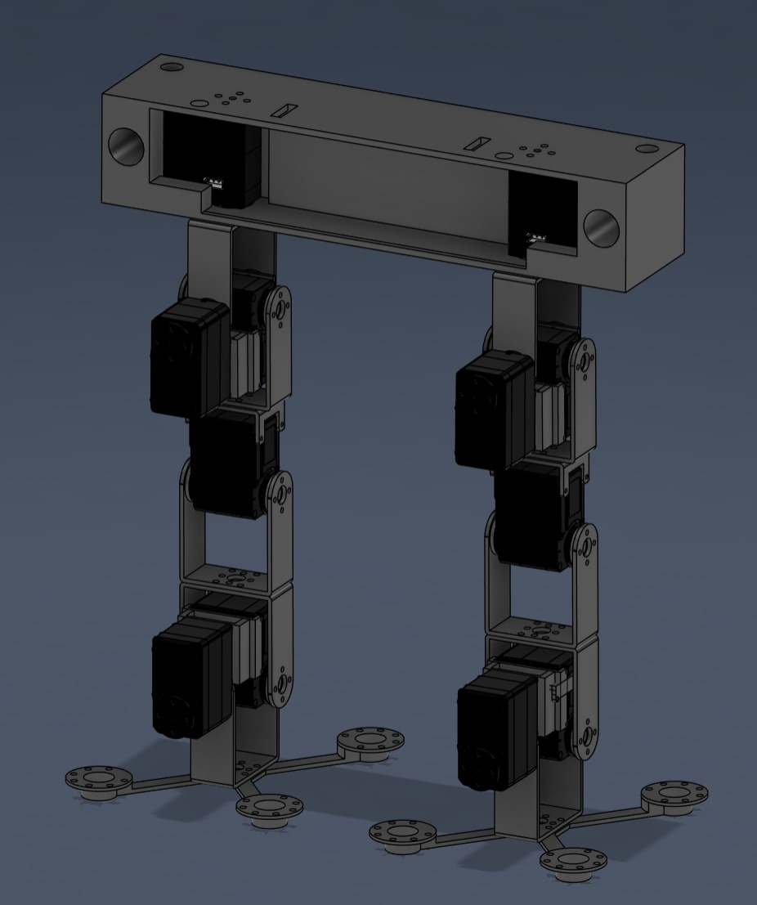
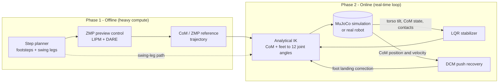
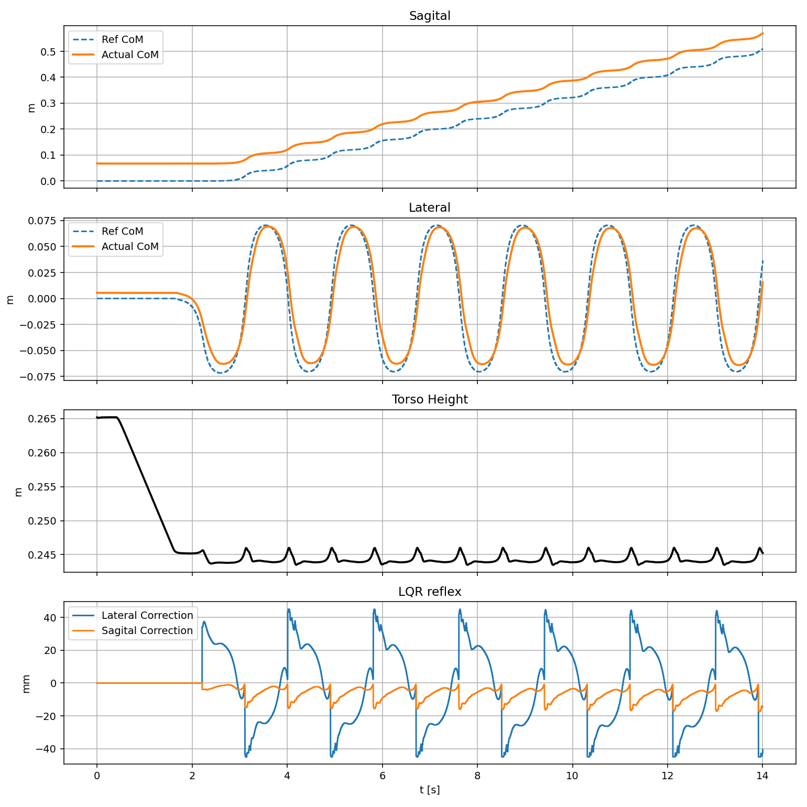
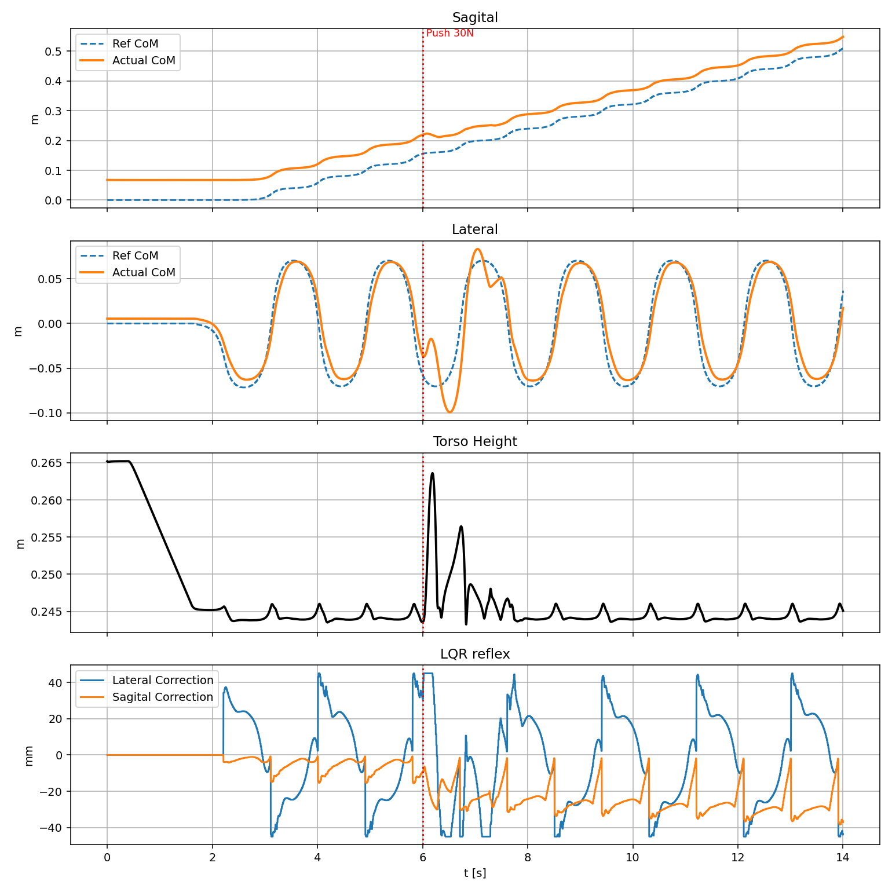
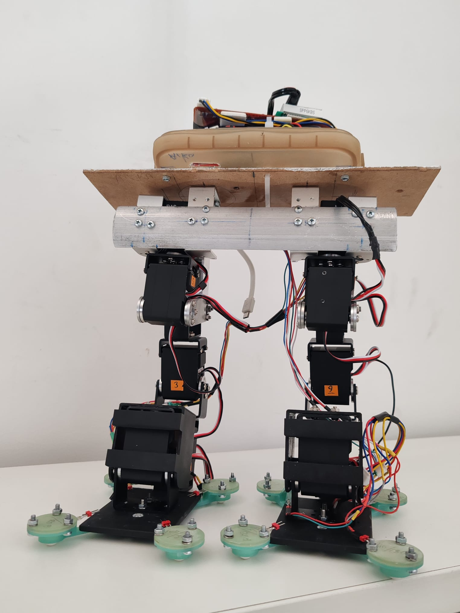

# GO2B — 12-DoF Bipedal Robot Simulation

**ZMP Preview Control · DCM Push Recovery · LQR Stabilization · MuJoCo**




**GO2B** is a custom-built, 12-degree-of-freedom (12-DoF) bipedal robot designed for **low-budget, resource-constrained hardware** such as the Teensy 4.1 microcontroller. This repository contains its simulation and control software, written in Python on top of the [MuJoCo](https://mujoco.org/) physics engine.

The central design idea is simple:

> **Do the heavy math offline. Keep the real-time loop tiny.**

Walking trajectories are computed ahead of time (ZMP preview control). A lightweight online loop (LQR stabilizer + DCM push recovery) only has to correct *errors*, which is cheap enough for a microcontroller.

> **Status:** this repository is a **simulation-only** release. The microcontroller firmware is not included, and sim-to-real transfer on the physical prototype is future work. See [Limitations](#limitations) and [Roadmap](#roadmap).

---

## Table of Contents

1. [Academic publication](#academic-publication)
2. [Key features](#key-features)
3. [How it works (in plain language)](#how-it-works-in-plain-language)
4. [System architecture](#system-architecture)
5. [Repository structure](#repository-structure)
6. [Installation](#installation)
7. [Usage](#usage)
8. [Simulation results](#simulation-results)
9. [Hardware platform](#hardware-platform)
10. [Limitations](#limitations)
11. [Roadmap](#roadmap)
12. [Troubleshooting](#troubleshooting)
13. [Contributing](#contributing)
14. [Citation](#citation)
15. [References](#references)
16. [License](#license)

---

## Academic Publication

The methods in this repository are based on our conference paper:

> Ünver, H. Ö., Lotfi, B., Eser, G. C., Ecevit, O. (2026). **"Development of Model Predictive Controlled 12-DoF Bipedal Robot: A Two-Phase Control Architecture Tailored for Low-Budget Bipedal Systems."**
> *21st International Conference on Machine Design and Production (UMTIK 2026), Istanbul, Türkiye.*
> [Read the paper (PDF)](assets/Development_of_Model_Predictive_Controlled_12-DoF_Bipedal_Robot.pdf)

---

## Key Features

- **Two-phase hierarchical control**
  - **Offline:** ZMP (Zero-Moment Point) preview control, built on the Linear Inverted Pendulum Model (LIPM) and a discrete algebraic Riccati equation (DARE), with a receding horizon. It generates stable walking trajectories.
  - **Online:** a fast LQR-based stabilizer corrects balance in real time.
- **DCM (Capture Point) push recovery.** The robot withstands external pushes (a 30 N lateral push in our tests). It computes the divergent component of motion (DCM) error and adjusts the foot landing position to keep its balance. An optional torso-tilt-to-ankle feedback is also available.
- **Analytical inverse kinematics.** A geometric, matrix-free solver for 6-DoF legs instead of a Jacobian-based solver. An optional damped-least-squares (DLS) refinement is available with `--refine-ik`.
- **Modular design.** Controllers, planner and kinematics are separate packages. By design, only `sim/mujoco_interface.py` (plus the viewer and logging glue in `main.py`) touches MuJoCo, so the control code can later be ported to firmware.
- **Built-in experiment tooling.** Push tests with visualization (arrow or real ball impact), video recording, telemetry plots, CSV traces and a JSON metadata file for every run.

---

## How It Works (in Plain Language)

You do not need a robotics PhD to follow this project. Here are the five ideas it is built on.

### 1. Walking is controlled falling

A biped is never truly standing still while it walks. It is like balancing a broomstick on your palm: to keep the stick up, you keep moving your hand underneath it. Robots do the same with their feet.

### 2. LIPM — the "broomstick" model

Instead of simulating every link and motor, we simplify the robot to **one point mass (the center of mass, CoM) on a massless stick at constant height** $z_c$. The motion of this model is:

$$\ddot{x} = \omega^2 \,(x - p), \qquad \omega = \sqrt{g / z_c}$$

Here $x$ is the CoM position, $p$ is where the robot "pushes" on the ground (the ZMP, below), and $g$ is gravity. It is a crude model, but it is simple enough to solve exactly, which is why it is so useful.

### 3. ZMP and preview control — "headlights on the road"

The **Zero-Moment Point (ZMP)** is the point on the ground where the robot's tipping moment is zero. Think of it as the center of pressure under your feet. For stable walking it must stay **inside the support area (the foot)**.

**Preview control** is like driving at night: you steer for the curve your headlights show *ahead*, not the one under your wheels. The controller knows where the ZMP *will* need to be over the next fraction of a second and plans the CoM motion to match. Mathematically, this is a Riccati-equation-based optimal controller (the DARE in `preview_controller.py`). It is solved offline, because it is the heavy part.

### 4. LQR — a pre-computed autopilot

Even a perfect plan meets reality: friction, modeling errors, small bumps. The **LQR (Linear Quadratic Regulator)** is a feedback law whose gains are computed once by solving an optimization problem. Online, the robot only applies those fixed gains to its measured error. That is cheap and fast, which is exactly what a low-cost microcontroller needs.

### 5. DCM / Capture Point — "where should I step to not fall?"

The **Divergent Component of Motion (DCM)**, also known as the capture point, is defined as:

$$\xi = x + \dot{x} / \omega$$

It answers one question: *"If I planted my foot right here, would I stop falling?"* Under the LIPM, the DCM is exactly that spot. If someone shoves the robot, the DCM jumps away from the foot. The controller measures this error and **moves the next landing position toward it**, so the robot recovers by taking a corrective step rather than fighting the push with its ankles.

### Bonus: analytical inverse kinematics

Given a desired foot position and orientation, **inverse kinematics (IK)** computes the six joint angles of the leg. Our solver uses closed-form geometry. It is fast, deterministic and needs no matrix inversions, so it is easy to port to firmware. A Jacobian-based refinement (`--refine-ik`) is optional.

---

## System Architecture


```mermaid
flowchart LR
    subgraph OFF["Phase 1 - Offline (heavy compute)"]
        P[Step planner<br/>footsteps + swing legs] --> Z[ZMP preview control<br/>LIPM + DARE]
        Z --> R[CoM / ZMP reference<br/>trajectory]
    end

    subgraph ON["Phase 2 - Online (real-time loop)"]
        R --> IK[Analytical IK<br/>CoM + feet to 12 joint angles]
        IK --> S[(MuJoCo simulation<br/>or real robot)]
        S -- "torso tilt, CoM state, contacts" --> L[LQR stabilizer]
        S -- "CoM position and velocity" --> D[DCM push recovery]
        L --> IK
        D -- "foot landing correction" --> IK
    end

    P -. swing-leg path .-> IK
```

| Phase | Where it runs | What it does |
| --- | --- | --- |
| **1. Offline** | Laptop / PC | Plans footsteps, solves the preview-control problem, produces the reference CoM/ZMP trajectory. |
| **2. Online** | Real-time loop (target: Teensy 4.1 at 500 Hz, i.e. a 2 ms period) | Tracks the reference, corrects balance errors (LQR), reacts to pushes (DCM), converts targets to joint angles (IK). |

---

## Repository Structure

```
├── main.py                            # Main orchestration loop and command-line interface
├── requirements.txt                   # Python dependencies
├── robot_final.xml, robot_walk.xml    # MuJoCo robot models
├── config/parameters.py               # All constants (gains, limits, simulation parameters)
├── kinematics/leg_ik.py               # Analytical inverse and forward kinematics
├── controllers/preview_controller.py  # LIPM and DARE preview controller
├── controllers/push_recovery.py       # DCM capture-point logic and stabilization
├── planners/step_planner.py           # Footstep trajectory and swing-leg generation
├── utils/data_logger.py               # Telemetry, logging and plotting
├── sim/mujoco_interface.py            # MuJoCo wrapper (robot, video recorder, push visualization)
├── tools/build_model.py               # Utility to fix CAD-exported XML files
└── assets/                            # STL meshes for the XML models, images and media
```

**Suggested reading order for newcomers:**

1. `config/parameters.py` — see every tunable number in one place.
2. `kinematics/leg_ik.py` — how joint angles are computed from foot poses.
3. `planners/step_planner.py` — how footsteps and swing legs are generated.
4. `controllers/preview_controller.py` — the LIPM + DARE trajectory generator.
5. `controllers/push_recovery.py` — the DCM logic.
6. `main.py` — how everything is stitched into one loop.

---

## Installation

Python 3.9 or newer is recommended.

```bash
git clone https://github.com/giraycevher/GO2B-12-DoF-Bipedal-Robot.git
cd GO2B-12-DoF-Bipedal-Robot
pip install -r requirements.txt
```

`requirements.txt` installs `numpy`, `scipy`, `mujoco`, `matplotlib`, and `imageio` with `imageio-ffmpeg` (the last two are only needed for video recording).

**Quick sanity check** (no window, no plot, 10 simulated seconds):

```bash
python main.py --headless --time 10 --no-plot
```

---

## Usage

```bash
python main.py                       # visual simulation with the free camera
python main.py --headless            # no window; prints telemetry and saves a plot
```

### Push tests

```bash
python main.py --push 30 --push-axis lat       # 30 N lateral push (default visualization: red arrow)
python main.py --push 30 --push-viz ball       # a real ball impact instead of an arrow
python main.py --push 15 --push-axis fwd       # forward push
python main.py --push 30 --no-dcm              # disable DCM push recovery for comparison
python main.py --push 0                        # no push (unperturbed walking)
```

By default the push is applied at t = 6 s for 0.1 s.

### Recording a video

```bash
python main.py --record walk.mp4
python main.py --record walk.mp4 --headless --width 1920 --height 1080 --fps 60
```

### Main options

| Option | Description |
| --- | --- |
| `--headless` | Run without a viewer window |
| `--xml PATH` | MuJoCo model to load (the default is set in `config/parameters.py`) |
| `--zhip` | Hip-center height above ground in meters |
| `--step-len` | Step length |
| `--push`, `--push-axis`, `--push-viz` | Push force in N, direction (`lat` or `fwd`), and visualization (`arrow`, `ball`, `none`) |
| `--no-dcm`, `--k-dcm` | Disable the DCM feedback, or set its gain (0 = off, 1.0 = full) |
| `--ankle-fb`, `--ankle-fb-sign` | Enable torso-tilt to ankle feedback; use `-1` if it makes balance worse |
| `--refine-ik` | Refine the analytical IK solution with damped least squares |
| `--time` | Maximum simulation time in seconds |
| `--speed` | Playback speed (1.0 = real time, 0 = as fast as possible) |
| `--record FILE.mp4`, `--fps`, `--width`, `--height` | Video recording settings |
| `--no-plot` | Do not generate the telemetry plot |

Run `python main.py --help` for the full list. Gains, limits and simulation constants live in `config/parameters.py`.

### Outputs

- A one-line status report per simulated second in the terminal (CoM progress, hip height, swing leg, contacts, DCM error and correction).
- A telemetry plot (unless `--no-plot` is set).
- `main_walk_trace_push<F>n.csv`: raw trace with the time, 12 joint commands and actual joint angles, base pose, CoM position and velocity, and foot contacts.
- `main_walk_trace_push<F>n.metadata.json`: run settings, exit reason, software versions, and a walked/fell result.

### Reproducing the two headline experiments

```bash
python main.py --push 0                          # Scenario 1: undisturbed walking
python main.py --push 30 --push-axis lat         # Scenario 2: 30 N lateral push, DCM on
python main.py --push 30 --push-axis lat --no-dcm  # same push, DCM off (comparison)
```

---

## Simulation Results

These are qualitative demonstrations of the two core behaviors. A systematic evaluation (success rates over randomized trials, push-recovery envelope, ablations, latency and noise robustness) is planned; the protocol is described in [`BENCHMARKING.md`](BENCHMARKING.md).

**Scenario 1: walking without disturbance.** The robot tracked the offline-generated CoM trajectory on flat ground. Although the LIPM assumption neglects leg masses, the simulation showed stable heel-strike and swing-leg transients.




**Scenario 2: 30 N lateral push.** A lateral force of 30 N was applied to the torso for 0.1 s during the walking cycle. The controller detected the drift. Instead of over-torquing the ankles, it moved the landing position of the swing leg toward the direction of the fall (capture point strategy).




---

## Hardware Platform

The simulation was developed alongside a physical 12-DoF prototype. The planned hardware stack:

| Subsystem | Choice |
| --- | --- |
| **Processing** | Teensy 4.1 (500 Hz online stabilization loop) |
| **Actuation** | ST series serial bus servomotors (e.g., ST 3025) |
| **State estimation** | MPU6050 IMU for torso orientation |
| **Contact sensing** | Custom foot pads with FSR (force-sensing resistor) arrays to estimate ground reaction forces and the ZMP |
| **Mechanical design** | Custom 3D-printed or machined brackets matched to the mass and inertia values in the MuJoCo model |



This repository contains the **Python simulation only**; the microcontroller firmware is not included. Full sim-to-real transfer of the push-recovery algorithm on the physical platform is future work.

---

## Limitations

Being explicit about what this project does *not* (yet) show:

- **Simulation only.** No results on the physical robot are reported.
- **LIPM assumptions.** The planner assumes a point-mass CoM at constant height and neglects leg dynamics. Real legs have mass and swing dynamics that the feedback loops must absorb.
- **Ideal-ish environment.** Walking is demonstrated on flat ground. Actuator dynamics (servo lag, backlash, torque limits, bus latency) and sensor noise are not yet modeled in detail.
- **Limited push evaluation.** The documented push test is a 30 N, 0.1 s lateral push at a fixed time. The full recoverable envelope (force, direction, gait phase) is not yet characterized.
- **Single physics engine.** Results come from MuJoCo only; contact models differ between simulators.

---

## Roadmap

- [x] ZMP preview control (LIPM + DARE) trajectory generation
- [x] LQR-based online stabilizer
- [x] DCM push recovery with foot-landing adjustment
- [x] Analytical inverse kinematics (+ optional DLS refinement)
- [x] Push visualization, video recording, telemetry logging
- [ ] Systematic benchmark suite with randomized trials and confidence intervals
- [ ] Push-recovery envelope (force × direction × gait phase)
- [ ] Realistic actuator model (lag, saturation, backlash, communication delay)
- [ ] Sensor models and state estimation (IMU noise, FSR-based ZMP)
- [ ] Unit tests and continuous integration
- [ ] Processor-in-the-loop test on a real Teensy 4.1
- [ ] Whole-body control (WBC) extension
- [ ] Firmware release and hardware sim-to-real validation

---

## Troubleshooting

| Problem | What to try |
| --- | --- |
| No window opens (remote server, WSL, CI) | Use `--headless`. |
| Video recording fails or is empty | Make sure `imageio` and `imageio-ffmpeg` are installed. On Linux without a display, set `MUJOCO_GL=egl` (or `osmesa`) before running. |
| Torso-tilt ankle feedback makes balance worse | Run with `--ankle-fb --ankle-fb-sign -1`. |
| You want to isolate the effect of DCM | Compare `--no-dcm` with the default, or sweep `--k-dcm` between 0 and 1. |
| Simulation runs too slowly or too fast | Adjust `--speed` (1.0 = real time, 0 = as fast as possible). |

---

## Contributing

Issues and pull requests are welcome, especially for benchmarks, tests, actuator/sensor models and firmware ports. Please keep MuJoCo-specific code inside `sim/mujoco_interface.py` so the controllers stay portable.

---

## Citation

If you use this work, please cite the paper above:

```bibtex
@inproceedings{unver2026go2b,
  title     = {Development of Model Predictive Controlled 12-DoF Bipedal Robot: A Two-Phase Control Architecture Tailored for Low-Budget Bipedal Systems},
  author    = {{\"U}nver, Hakk{\i} {\"O}zg{\"u}r and Lotfi, B. and Eser, Giray Cevher and Ecevit, O.},
  booktitle = {21st International Conference on Machine Design and Production (UMTIK)},
  year      = {2026},
  address   = {Istanbul, T{\"u}rkiye}
}
```

---

## References

- S. Kajita et al., "The 3D Linear Inverted Pendulum Mode: A simple modeling for a biped walking pattern generation," *IROS*, 2001.
- S. Kajita et al., "Biped walking pattern generation by using preview control of zero-moment point," *ICRA*, 2003.
- M. Vukobratović and B. Borovac, "Zero-Moment Point — Thirty Five Years of Its Life," *International Journal of Humanoid Robotics*, 2004.
- J. Pratt et al., "Capture Point: A Step toward Humanoid Push Recovery," *IEEE-RAS Humanoids*, 2006.
- J. Englsberger, C. Ott, A. Albu-Schäffer, "Three-Dimensional Bipedal Walking Control Based on Divergent Component of Motion," *IEEE Transactions on Robotics*, 2015.
- E. Todorov, T. Erez, Y. Tassa, "MuJoCo: A physics engine for model-based control," *IROS*, 2012.

---

## License

Released under the [MIT License](LICENSE).
